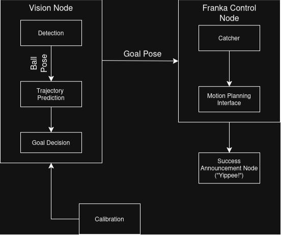

## ME450-FinalProject-Catchers (Group 1)

This repository holds the package for the ME-450 final project of Team Catchers.

Authors : [Anunth Ramaswami](https://github.com/anunthramaswami2030), [Kasina Jyothi Swaroop](https://github.com/kjyothiswaroop), [Kyle Thompson](https://github.com/KThompson2002) , [Zixin Ye](https://github.com/zixinyenu)

## Project Overview

The project aims at catching a ball using a Franka Emika Robot Arm. The ball is tracked using a Realsense camera and a trajectory prediction node predicts the pose of the ball at the instant it intersects with a designated plane and command the robot to move to the goal_pose.

## Prerequisites
- The `realsense2_camera` driver installed (from Intel RealSense ROS2 package).
- The `ultralytics` package installed using [Ultralytics](https://nu-msr.github.io/ros_notes/ros2/computer_vision.html#ultralytics-yolo-1-P-1)
- The `modern_robotics` library following similar instructions as Ultralytics.
- A RealSense camera physically connected to the machine and accessible by the driver.
- Clone and build the packages:
  ```bash
  mkdir -p ws/src
  cd ws/src
  git clone git@github.com:ME495-EmbeddedSystems/final-project-catchers.git
  cd ../
  vcs import src < src/final-project-catchers/final.repos
  colcon build
  source install/setup.bash
  ```

## How to run

1. Plug in the RealSense camera into your machine.

2. In another terminal (with the catchers_ws sourced), launch the `detect.launch.xml`:

- If camera calibration is required(usually when camera is moved), attach the ArUco marker of ID `25` from the family
  `DICT_6X6_1000` at the end effector of the franka robot arm and run the command below and follow the calibration procedure as described in [Camera_Calibration](https://github.com/kjyothiswaroop/easy_handeye2/blob/master/README.md)

    ```bash
    ros2 launch catchers_vision detect.launch.xml demo:=false calibrate:=true
    ```

- If calibration file already exists at `.ros2/easy_handeye2/calibrations/my_eob_calib.calib`, then run the below command to start detecting the ball and publishing transforms.

    ```bash
    ros2 launch catchers_vision detect.launch.xml demo:=false calibrate:=false
    ```
3. Call the service `pick_hoop` to pick up the hoop.
   ```bash
   ros2 service call /pick_hoop std_srvs/srv/Empty
   ```
4. Call the service `toggle` to move the robot from the ready position to the plane where it will catch the robot.
   ```bash
   ros2 service call /toggle std_srvs/srv/Empty
   ```
5. Call the service `reset_throw` to reset any stray predictions by the model and get ready for the new throw, this will remove all the previous detections and predictions of ball pose from Rviz.
   ```bash
   ros2 service call /reset_throw std_srvs/srv/Empty
   ```
And thats it, the Robot Arm is now ready to catch a ball!
   

## Usage of the Launch file
The `catchers_vision` package has one important launch file `detect.launch.xml.`
- It expects two parameters which are :
    - `demo` (default value = true)
    - `calibrate` (default value = false)

- ### What `detect.launch.xml` does

    - Starts the `rs_launch.py` from the `realsense2_camera` package.
        - Camera is launched at 60fps at a lower resolution and depth alignment.

    - Starts the `pickplacelaunch.xml` from `robot_mover` package.

        - If `demo` is `true` then the franka launches in Rviz along with Moveit.

        - If `demo` is `false` then only the rviz launches(it is expected that a real Franka arm is connected and running the moveit launch file on the real Franka arm.)

    - If `calibrate` is `true`:

        - The `aruco_detect` node starts and : 
            - Loads parameters from `config/aruco_params.yaml` (marker size, dictionary, detection thresholds, etc.).

            - Subscribes to the camera image and camera info topics exposed by a camera driver (for this project we use an Intel RealSense camera).

            - Performs ArUco marker detection and publishes marker info (see `catchers_vision_interfaces/msg/ArucoMarkers.msg`) and publishes updated image with ArUco Detection on a new ROS2 topic.

        - The `calibrate.launch.xml` :
            - Launches the calibration pipeline of `easy_handeye2` package.

            - At the end of the pipeline, saves the calibration to `.ros2/easy_handeye2/calibrations/my_eob_calib.calib`.

    - If calibrate is `false`:
        
        - The `publish.launch.xml` :
            - Launches the transform publishing pipeline from the calibration step.

            - Publishes a transform between `base` and `camera_link` frames.
        
        - The `ball_track` node from the `catchers_vision` package:
            - Detects and tracks a ball in 3D space using OpenCV or YOLO models.

            - Publishes a transform between `camera_color_optical_frame` and `ball` frames.

            - Publishes the detected ball in the image with the centroid on a new ROS2 topic.

## Project Architecture



## Limitations and Future Scope

### Current Limitations
The project works as expected but the robot will not be able to catch every ball thrown within its workspace due to the following reasons:

1) Timing
    - The ball is in flight for only about ~ 1 sec.
    - The Franka Emika Panda Robot takes about ~0.56 sec to move to a goal in its planar workspace at maximum velocity and acceleration scaling using the cartesian planning.
    - The trajectory predictor needs to wait for sometime to get accurate measurements to give an accurate goal_pose.

2) Camera
    - The realsense camera depth range is short thus limiting us to throw from regions closer to the robot and try and catch it.
    - This directly impacts our ability to throw the ball from farther which would allow it to be in flight for longer while getting reliable detections.

### Improvements tried
The following improvements were tried to overcome the limitations mentioned above:

1) Plan Caching
    - We save plans apriori by commanding the robot to go to multiple places in the desired workspace collect the plans and query them at runtime.
    - This did not prove to be very helpful because we observed that the planning only takes about ~0.014 sec and the execution is where the robot is unable to catchup with the ball.

2) Zed Camera
    - The Zed2i camera provides a better depth range and can operate at a higher fps while not loosing resolution.
    - The ZED-SDK offers inbuilt YOLO models which are optimized to work faster on the ZED camera.
    - The ZED-ROS2 wrapper is not supported for kilted, hence we ended up implementing our own wrapper to extract color,depth images and camera info.
    - This did not help either because the way wrapper was implemented in python, we were missing depth frames multiple times and thus not getting reliable detections.
    - The YOLO model we trained didnt work as expected on ZED, whereas on the Realsense it showed a great performance(Note: the YOLO was retrained for images from the ZED camera only and yet it didnt work well).

## Demo Videos
Video demonstation of the project:

[catchingball](https://github.com/user-attachments/assets/5c5c8cdc-81b9-49b4-8460-3c235efb2a31)

## Directory Structure

```bash
final-project-catchers
├── catchers_vision
│   ├── calib
│   │   └── my_eob_calib.calib
│   ├── catchers_vision
│   │   ├── aruco.py
│   │   ├── ball_track.py
│   │   ├── cv.py
│   │   ├── stream.py
│   │   ├── stream_tester.py
│   │   ├── trajectory_prediction.py
│   │   └── traj_pred_node.py
│   ├── config
│   │   ├── aruco_params.yaml
│   │   └── ball_track.yaml
│   ├── launch
│   │   ├── calib.launch.xml
│   │   ├── detect.launch.xml
│   │   └── publish.launch.xml
│   ├── model
│   │   └── ball-detect-3.pt
│   ├── package.xml
│   ├── resource
│   │   └── catchers_vision
│   ├── setup.cfg
│   ├── setup.py
│   └── test
│       ├── test_copyright.py
│       ├── test_flake8.py
│       ├── test_pep257.py
│       └── test_xmllint.py
├── catchers_vision_interfaces
│   ├── CMakeLists.txt
│   ├── LICENSE
│   ├── msg
│   │   └── ArucoMarkers.msg
│   └── package.xml
├── final.repos
└── README.md
```
